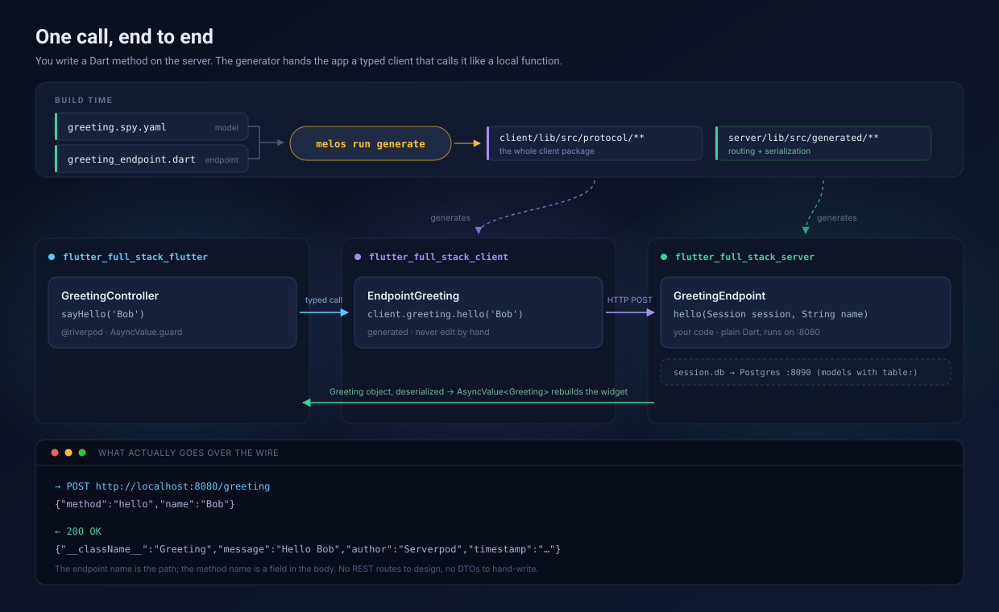
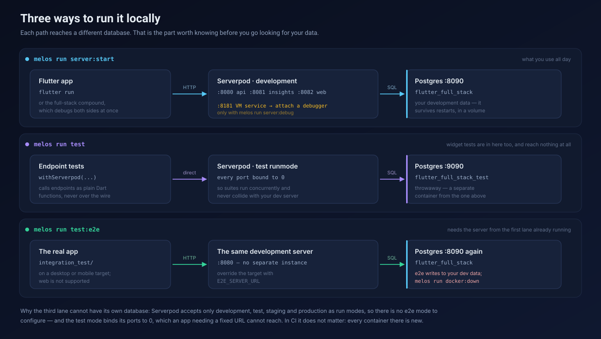

# flutter_full_stack

A Serverpod backend and a Flutter app in one Melos monorepo. You write Dart on
the server; the app calls it as if it were a local function.

<p align="center">
  
</p>

## How it works

### Serverpod, in one idea

Most backends make you design a URL scheme, then hand-write a DTO on the server,
a matching DTO in the app, and the serialization glue between them. Serverpod
deletes that middle layer. You write two kinds of file:

**A model** — a `.spy.yaml` describing data:

```yaml
class: Greeting
# table: greeting          # add this and it becomes a Postgres table too
fields:
  message: String
  author: String
  timestamp: DateTime
```

**An endpoint** — a plain Dart class whose public methods are callable from the
app. The first parameter is always a `Session`:

```dart
class GreetingEndpoint extends Endpoint {
  Future<Greeting> hello(Session session, String name) async {
    return Greeting(message: 'Hello $name', author: 'Serverpod', /* … */);
  }
}
```

That is the whole backend. No route table, no controller, no JSON mapping.

`Session` is the request context: `session.db` for the database,
`session.passwords` for secrets, `session.log(...)` for logging, and the
authenticated user when there is one.

### The generator builds both ends of the wire

`melos run generate` reads your models and endpoints and writes, in one pass:

- **`flutter_full_stack_server/lib/src/generated/**`** — the model classes,
  serialization and the routing table the server uses to dispatch calls.
- **`flutter_full_stack_client/**`** — the *entire* client package: the same model
  classes, plus a typed method for every endpoint method.
- **`serverpod_test_tools.dart`** — helpers that let tests call endpoints
  directly.

Because both sides come from the same source, they cannot disagree. That is also
why **generated code is never edited by hand** — the next generate run discards
your changes. Change the model or the endpoint instead.

### How your endpoint becomes `client.greeting.hello('Bob')`

Two mechanical renames, and one thing removed:

| Server | App |
|---|---|
| `class GreetingEndpoint` | `client.greeting` — the `Endpoint` suffix is dropped, first letter lowercased |
| `Future<Greeting> hello(Session session, String name)` | `Future<Greeting> hello(String name)` — `Session` is server-side only |
| `class Greeting` (from the `.spy.yaml`) | the same `Greeting` class, generated into the client package |

So the app gets `Future<Greeting>` — the real type, not a `Map`. Rename a field
in the YAML and the app stops compiling, which is the point.

### On the wire

There is no magic underneath. The endpoint name is the path, the method name is
a field in the body:

```console
$ curl -X POST http://localhost:8080/greeting \
    -H 'Content-Type: application/json' \
    -d '{"method":"hello","name":"Bob"}'

{"__className__":"Greeting","message":"Hello Bob","author":"Serverpod","timestamp":"2026-09-05T12:03:45.316794Z"}
```

Useful when debugging: you can reach any endpoint with `curl` and see exactly
what the app would have received.

### How the Flutter app connects

One provider owns the client for the whole app —
[`serverpod_client.dart`](flutter_full_stack_flutter/lib/core/providers/serverpod_client.dart):

```dart
@Riverpod(keepAlive: true)
Future<Client> serverpodClient(Ref ref) async {
  final client = Client(await getServerUrl())
    ..connectivityMonitor = FlutterConnectivityMonitor()
    ..authSessionManager = FlutterAuthSessionManager();
  await client.auth.initialize();
  return client;
}
```

`getServerUrl()` resolves the backend address in this order:

1. `--dart-define=SERVER_URL=https://api.example.com/`, if you passed one
2. otherwise `assets/config.json` → its `apiUrl` field
3. otherwise `http://localhost:8080/`

Step 2 is worth understanding: when the Flutter **web** build is served by the
Serverpod web server, that `config.json` is produced *by the server* at runtime
via [`AppConfigRoute`](flutter_full_stack_server/lib/src/web/routes/app_config_route.dart).
The same build therefore points at the right API in every environment, with no
rebuild — the server tells the app where it lives.

Features then call the client through a controller, which keeps loading and error
states in `AsyncValue` rather than in hand-rolled booleans:

```dart
@riverpod
class GreetingController extends _$GreetingController {
  @override
  FutureOr<Greeting?> build() => null;

  Future<void> sayHello(String name) async {
    state = const AsyncLoading();
    state = await AsyncValue.guard(() async {
      final client = await ref.read(serverpodClientProvider.future);
      return client.greeting.hello(name);
    });
  }
}
```

The widget does `ref.watch(greetingControllerProvider)` and switches on the
`AsyncValue`. That is the full round trip.

### Authentication

`serverpod_auth_idp` supplies email/password sign-in with JWT. Exposing it is a
one-line subclass per endpoint — see
[`lib/src/auth/`](flutter_full_stack_server/lib/src/auth/) — and the providers are
wired in [`lib/server.dart`](flutter_full_stack_server/lib/server.dart). On the app
side, `FlutterAuthSessionManager` persists the tokens across launches, and token
renewal is handled for you: when a call comes back `401`, the client refreshes
the access token once and retries that same call before surfacing an error.

## The three packages

| Package | Kind | Role |
|---|---|---|
| [`flutter_full_stack_server`](flutter_full_stack_server) | Dart | The backend. Models, endpoints, migrations, web routes. **This is where you work.** |
| [`flutter_full_stack_client`](flutter_full_stack_client) | Dart | Generated API client. Committed so the app builds without running the generator, but never hand-edited. |
| [`flutter_full_stack_flutter`](flutter_full_stack_flutter) | Flutter | The app. Riverpod + go_router, both code-generated. |

It is a native Dart workspace: a single `pubspec.lock` at the root, and one
`dart pub get` there resolves all three packages together.

## Requirements

- Flutter **3.47.2** (bundles Dart 3.13.2) — the version CI runs
- Docker, for Postgres and Redis
- Serverpod CLI: `dart pub global activate serverpod_cli 4.0.0-rc.2`

## Getting started

```bash
# 1. Dependencies (one resolve covers the whole workspace)
dart pub get

# 2. Secrets — the real file is git-ignored
cp flutter_full_stack_server/config/passwords.example.yaml \
   flutter_full_stack_server/config/passwords.yaml
#    then fill it in, following the comments inside

# 3. Containers + server
melos run server:start

# 4. The app, in another terminal
cd flutter_full_stack_flutter && flutter run
```

The server comes up on **http://localhost:8080** (API) and
**http://localhost:8082** (web). VS Code users can instead pick the
**flutter_full_stack (server + app)** compound launch configuration, which starts
the containers, the server and the app together.

## Everyday commands

```bash
melos run check          # format + analyze + test — run before every commit
melos run generate       # regenerate client, protocol and *.g.dart files
melos run generate:watch # rebuild the app's *.g.dart on save, while coding
melos run test           # tests only (needs `melos run docker:up`)
melos run test:e2e       # end-to-end: real app → real server → real Postgres
melos run server:debug   # like server:start, with the VM service open
melos run docker:up      # Postgres + Redis, without starting the server
melos run server:stop    # stop the containers
```

`melos run` with no arguments lists every available script.

## Running and testing locally

<p align="center">
  
</p>

| Layer | Where | What it proves |
|---|---|---|
| Endpoint tests | `flutter_full_stack_server/test/integration/` | an endpoint returns the right thing, calling it as a Dart function via `withServerpod` |
| Widget tests | `flutter_full_stack_flutter/test/` | a screen renders and reacts, with no backend involved |
| End-to-end | `flutter_full_stack_flutter/integration_test/` | the real app, the generated client, HTTP and Postgres actually work together |

Only the last layer catches a stale generated client, a missing migration or a
changed serialization — so keep it small and about the critical path. It needs a
server running, and lives outside `melos run check` for that reason:

```bash
melos run server:start        # one terminal
melos run test:e2e            # another
```

The target is an Android emulator or an iOS simulator: `integration_test` does
not run on web devices, and the app no longer has desktop targets. `E2E_DEVICE`
picks one by device id when several are attached, and `E2E_SERVER_URL` picks
the backend — on an Android emulator that has to be `http://10.0.2.2:8080/`,
since `localhost` there means the emulator itself. See [AGENTS.md](AGENTS.md)
for that and the other constraints.

## Debugging

Breakpoints work on both sides of a call, and pause the real request.

In VS Code, press F5 and pick **flutter_full_stack (server + app)**: it starts the
containers, then runs the server and the app together under the debugger, so a
breakpoint in an endpoint and one in a Riverpod controller both hit in turn.
Stopping either stops both.

For a server you started in a terminal, `melos run server:start` exposes no VM
service and nothing can attach to it. Use the debug variant, then pick **Attach
to the running server**:

```bash
melos run server:debug     # VM service on http://127.0.0.1:8181/
```

At a breakpoint you get the endpoint arguments plus the live `Session`, and from
there `session.db` and the authenticated user. Breakpoints in the *generated*
client work too, with no configuration — it is a workspace path dependency, not
a pub package. Stepping deeper, into `package:serverpod_client` where the HTTP
request is built, needs `dart.debugExternalPackageLibraries`.

One thing that catches people out: while you sit on a breakpoint the caller
stays blocked, so the app or `curl` eventually times out. That is not a bug.
[AGENTS.md](AGENTS.md) has the details.

## Adding a feature

The short version:

1. Model in `flutter_full_stack_server/lib/src/<feature>/<name>.spy.yaml`
2. Endpoint in `<feature>_endpoint.dart` beside it
3. `melos run generate`
4. `serverpod create-migration`, but only if you touched a `table:`
5. Controller and screen under `flutter_full_stack_flutter/lib/features/<feature>/`
6. Tests, then `melos run check`

The long version, with the traps, is in **[AGENTS.md](AGENTS.md)**. For the app
side specifically — which folder a file belongs in, how a controller reaches the
backend, and what happens between a tap and a repainted screen — see
**[docs/flutter-architecture.md](docs/flutter-architecture.md)**.

## Ports

| Port | Service |
|---|---|
| 8080 / 8081 / 8082 | API / Insights / web server |
| 8181 | Dart VM service, only under `melos run server:debug` |
| 8090 / 8091 | Postgres / Redis (dev containers) |
| 9090 / 9091 | Postgres / Redis (test containers) |

Redis is `enabled: false` in the dev and test configs; the containers run
regardless, so turning it on is a one-line change.

## Before you commit

Run `melos run check`. It runs the same format, analyze and test steps as CI.

CI additionally verifies that generated code is up to date. If you changed a
model, an endpoint or a provider, run `melos run generate` and commit whatever
it produces — a dirty `git status` afterwards means the pipeline will fail.

## Learn more

- Conventions and the rules around generated code: **[AGENTS.md](AGENTS.md)**
- How the Flutter layer is put together, with diagrams:
  **[docs/flutter-architecture.md](docs/flutter-architecture.md)**
- [Serverpod documentation](https://docs.serverpod.dev)
- [Riverpod documentation](https://riverpod.dev)
