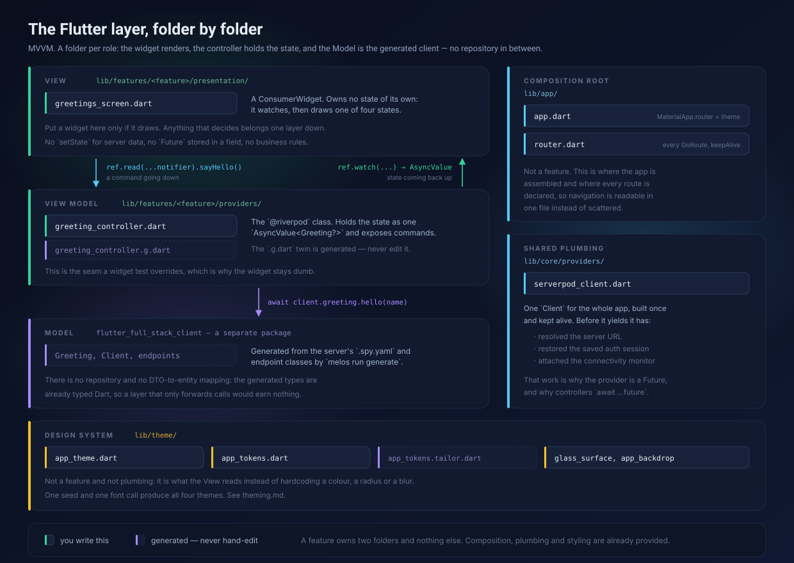
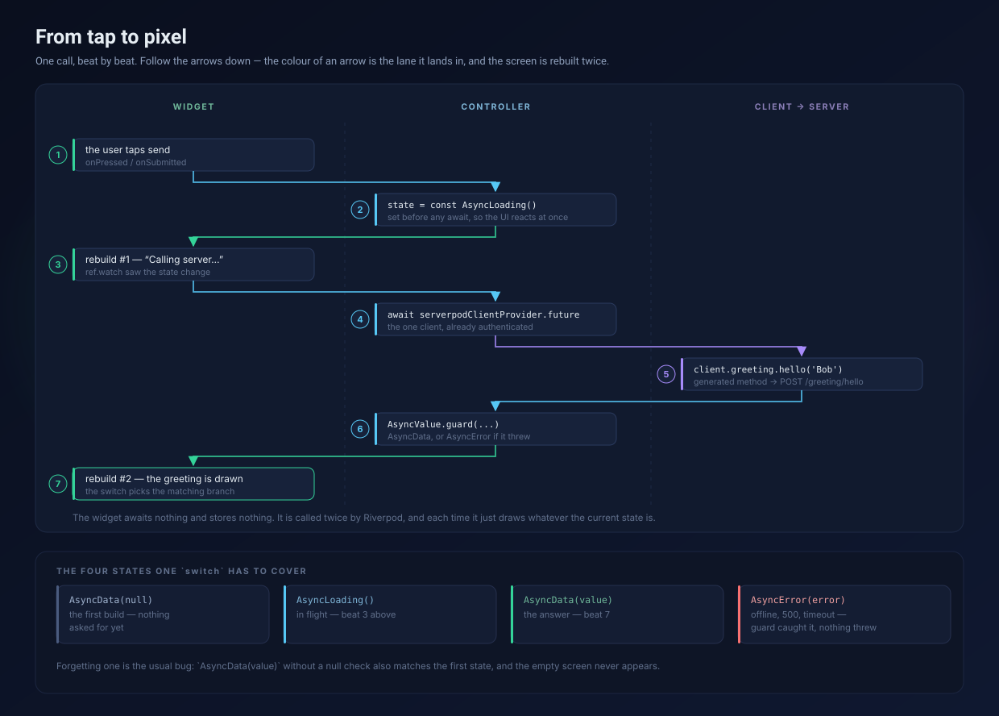

# The Flutter layer

How the app is organised, what the architecture is called, and what actually
happens between a tap and a repainted screen.

Read the two diagrams first. Everything below them is detail.

- **New here?** The diagrams plus *Where code goes* is enough to place your
  first file correctly.
- **Reviewing the design?** *Why there is no repository* is the part with a
  trade-off in it.

## In one sentence

**MVVM.** The widget is the View, a Riverpod controller is the ViewModel, and
the Model is the generated `flutter_full_stack_client` package. There is no
repository layer and no domain-entity layer, and that is deliberate — see the
last section.

What it is *not*: Clean Architecture. There are no use-case classes, no
repository interfaces and no mapping between DTOs and entities. If you arrive
expecting those folders, you will not find them.



## Where code goes

| Path | Role | Who writes it |
|---|---|---|
| `lib/features/<feature>/presentation/` | **View** — widgets that render state | you |
| `lib/features/<feature>/providers/` | **ViewModel** — `@riverpod` controllers | you (`.g.dart` generated) |
| `lib/app/` | Composition root — `MaterialApp.router`, every route | you |
| `lib/core/providers/` | Shared plumbing — the one Serverpod client | you (`.g.dart` generated) |
| `flutter_full_stack_client` | **Model** — typed API models and the client | the generator, never you |

Two rules keep this honest:

1. **A feature owns exactly two folders.** If you are about to add a third,
   what you have is either shared plumbing (`lib/core/`) or a second feature.
2. **Widgets decide nothing.** No `setState` for server data, no stored
   `Future`, no business rules. A widget that needs to decide something is a
   controller that has not been written yet.

The `<feature>` folder name is yours to choose, but it should match the server's
domain folder — `lib/src/greetings/` on the server, `lib/features/greetings/`
here. That symmetry is what makes a change easy to follow across packages.

## Code generation, and the `_$` classes

Every provider in this app is generated, and the first time you write one the
code does not compile. That is the workflow, not a mistake you made:

```dart
part 'greeting_controller.g.dart';   // does not exist yet

@riverpod
class GreetingController extends _$GreetingController {   // neither does this
```

Write it anyway, run `melos run generate`, and both appear.

**The name is mechanical**: `_$` followed by your class name. There is nothing
to look up, and nothing to copy out of the generated file.

**It is `part`, not `import`, and it has to be.** The leading `_` makes
`_$GreetingController` private to its library. `part` / `part of` make the two
files *the same* library, so the private name is visible. An `import` could
never see it.

**The generator reads your class, not the other way around.** It finds the
`@riverpod` annotation and picks the base class from what your `build()`
returns:

| `build()` returns | generated base | so `state` is |
|---|---|---|
| `Greeting?` | `$Notifier<Greeting?>` | `Greeting?` |
| `FutureOr<Greeting?>` or `Future<…>` | `$AsyncNotifier<Greeting?>` | `AsyncValue<Greeting?>` |
| `Stream<Greeting>` | `$StreamNotifier<Greeting>` | `AsyncValue<Greeting>` |

That table is also the answer to a question that comes up later: `state` and
`ref` are not magic, they are inherited from that base class. And choosing
`FutureOr` over a plain value is what gives you the four states further down —
it is a decision, not boilerplate.

The generated file also declares `greetingControllerProvider`, which is why
renaming the class means regenerating before anything compiles again.

**The source is the only truth.** Deleting a `.g.dart` and running
`melos run generate` reproduces it byte for byte, which is why editing one by
hand is pointless — see [AGENTS.md](../AGENTS.md) for the full list of files
that rule covers.

### Living with the gap

The analyzer is right to complain while the `.g.dart` is missing — `_$Foo` and
`state` really are undefined — and the errors only clear once you generate.
Rather than generating by hand after every edit, leave the watcher running:

```bash
melos run generate:watch
```

It rebuilds on save, incrementally, in well under a second, and it picks up a
brand-new file without being restarted. The first start is slower, because
build_runner compiles its builders once. Note that it reacts to *content*: an
editor that saves without changing anything triggers nothing.

It covers the Flutter package only. `melos run generate` is still the full pass,
and the one to run before committing, since it also runs the Serverpod
generator and formats.

A deleted `.g.dart` needs no special treatment either. build_runner notices the
missing output and rewrites it — the watcher logs it as `1 fixed`, and so does
the one-shot build behind F5, which is why launching the app is enough to
recover from having thrown one away.

## The glue: Riverpod and the backend

One provider owns the client for the entire app —
[`serverpod_client.dart`](../flutter_full_stack_flutter/lib/core/providers/serverpod_client.dart):

```dart
@Riverpod(keepAlive: true)
Future<Client> serverpodClient(Ref ref) async {
  final client = Client(await getServerUrl())
    ..connectivityMonitor = FlutterConnectivityMonitor()
    ..authSessionManager = FlutterAuthSessionManager();
  await client.auth.initialize();
  return client;
}
```

Three properties of that provider explain most of the code around it:

- **It is a `Future`.** Before it can yield a usable client it resolves the
  server URL, restores the saved auth session and attaches the connectivity
  monitor. So controllers write `await ref.read(serverpodClientProvider.future)`.
  Reading it without `.future` gives you an `AsyncValue`, not a `Client`.
- **It is `keepAlive`.** Rebuilding it would drop the authenticated session and
  re-resolve the URL on every screen. Feature controllers are *not* keepAlive —
  they should die with their screen.
- **It is the only place that knows the server exists.** Nothing else in the app
  constructs a `Client`.

`getServerUrl()` resolves the address in order: a `--dart-define=SERVER_URL`,
then `assets/config.json`, then `http://localhost:8080/`.

## From tap to pixel



The controller is the whole of it —
[`greeting_controller.dart`](../flutter_full_stack_flutter/lib/features/greetings/providers/greeting_controller.dart):

```dart
@riverpod
class GreetingController extends _$GreetingController {
  @override
  FutureOr<Greeting?> build() => null;          // the empty state

  Future<void> sayHello(String name) async {
    state = const AsyncLoading();               // rebuild #1
    state = await AsyncValue.guard(() async {   // rebuild #2
      final client = await ref.read(serverpodClientProvider.future);
      return client.greeting.hello(name);
    });
  }
}
```

`AsyncValue.guard` is what makes the error path boring. It runs the callback and
returns `AsyncData` if it succeeded or `AsyncError` — carrying the original
stack trace, not the one from the catch site — if it threw. It never throws
itself, which is why the line reads as a plain assignment.

That last property is the point rather than a detail. `sayHello` is
fire-and-forget: the widget calls it inside `unawaited(...)`, so nobody is
waiting to catch anything. Without `guard`, a dropped connection would escape as
an unhandled async error, the console would get a red line the user never sees,
and the screen would sit on `AsyncLoading` forever, because the assignment after
the failing call would never run. With it, the failure is just the next state.

So nothing in the app needs a `try`/`catch` for a failed request, and nothing
needs an `isLoading` flag — the state *is* the flag. `guard` is not free of
judgement, though: it does not belong in `build()`, where Riverpod already turns
a throw into `AsyncError`, and it should not swallow errors that are bugs. The
`flutter-screen` skill has the decision rule.

The widget then reacts, and only reacts:

```dart
final state = ref.watch(greetingControllerProvider);            // the state
unawaited(
  ref.read(greetingControllerProvider.notifier).sayHello(name), // the command
);
```

That pair is the single most common source of confusion: the provider gives you
the **state**, `.notifier` gives you the **controller**. Reading the provider and
calling a method on it fails with a member-not-found on `AsyncValue`, which says
nothing about what you actually got wrong.

Rendering switches over the four states — see
[`greetings_screen.dart`](../flutter_full_stack_flutter/lib/features/greetings/presentation/greetings_screen.dart).
The `AsyncData(:final value) when value != null` guard matters: without it, the
branch also swallows the initial `AsyncData(null)` and the empty state never
shows.

## Why there is no repository

The usual layered advice puts a repository between the ViewModel and the
network, to hide the transport and to map wire types onto domain types. Here
both jobs are already done:

- The transport is hidden — `client.greeting.hello('Bob')` is a generated Dart
  method. There is no HTTP, no JSON and no URL to abstract away.
- There is nothing to map — `Greeting` is generated from the same `.spy.yaml`
  the server uses. A DTO-to-entity mapping would copy a class onto an identical
  class.

A repository here would be a file that forwards calls and adds a name. So the
controller talks to the client directly, and the seam for tests is the
controller itself, which a widget test overrides.

**When that stops being true**, add the layer — do not force this shape:

- a screen needs data from more than one endpoint combined
- results must be cached, or served offline from a local database
- the same query is issued from several features and the policy must live in
  one place

At that point the repository earns its keep, and it goes in
`lib/features/<feature>/data/` — or `lib/core/` if genuinely shared.

## Where to go next

| You want to | Go to |
|---|---|
| Add a screen, controller or route | the `flutter-screen` skill |
| Write a widget or end-to-end test | the `flutter-testing` skill |
| Add or change an endpoint | the `serverpod-endpoint` skill |
| See the whole round trip across packages | [`architecture.svg`](architecture.svg) |
| Know which commands to run | [AGENTS.md](../AGENTS.md) |
