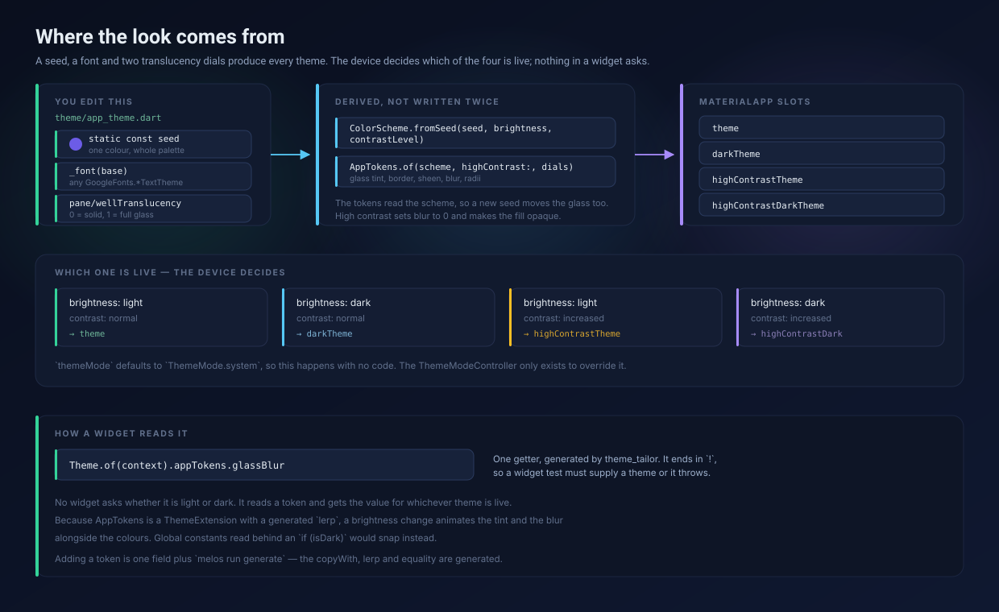
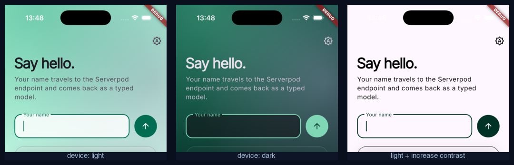

# Theming

Two knobs produce the whole look: a seed colour and a font call. Everything
else — light, dark, both high-contrast variants, and the glass — is derived
from them.



## What a token is

A *design token* is a named value at the bottom of a design system: not
`Color(0x66FFFFFF)` and `blur: 10` spread across the widgets that happen to
need them, but a name for the intent — `glassTint`, `glassBlur` — that screens
quote instead.

The reason to bother is the direction changes travel. With literals, changing
how the glass looks means finding every call site that passes a number, and
staying consistent depends on everyone typing the same one. With tokens it is
one file, and consistency is the default rather than an act of discipline.

`ThemeData` is already a token system in this sense — `colorScheme.primary` and
`textTheme.bodyMedium` are tokens. What it lacks is a slot for anything
Material does not have a concept of: there is no `ThemeData.glassBlur`. A
`ThemeExtension` is Flutter's own answer to that, which is why the file is
called `app_tokens`: these are *this app's* tokens, the complement to the ones
Material already provides.

Three properties are what make the name honest here:

- **Named for intent, not value.** `glassHighlight` says what the colour is
  for. `Colors.white.withValues(alpha: 0.35)` says how it is currently
  achieved, and stops being true the moment dark mode wants something else.
- **One origin.** Every token is derived from the `ColorScheme`, which comes
  from the seed. They are not a second palette that can drift from the first.
- **Coherent variants.** The same `glassBlur` is 14 in light, 18 in dark and 0
  in high contrast. A widget asks for the token and gets the value for
  whichever theme is live.

That last one is why no screen in this app contains an `if (isDark)`. The
widget declares *what it wants*; the theme decides *how much it is*.

The word is industry vocabulary rather than a Flutter term — it is what
designers and developers can both say, and Material 3 describes its own palette
that way. `AppStyle` or `AppSurfaces` would mean nearly the same thing if the
team prefers plainer names.

## Where it lives

| File | Role |
|---|---|
| `lib/theme/app_theme.dart` | the two knobs, and the four `ThemeData` |
| `lib/theme/app_tokens.dart` | the tokens Material has no slot for |
| `lib/theme/app_tokens.tailor.dart` | generated — `copyWith`, `lerp`, equality |
| `lib/theme/glass_surface.dart` | the translucent pane |
| `lib/theme/aurora_backdrop.dart` | the surface a screen sits on |
| `lib/theme/rise_in.dart` | the staggered entrance |
| `lib/theme/theme_mode_controller.dart` | lets a user override the device |
| `assets/fonts/` | Inter, bundled, plus its OFL licence |

## Changing the look

**Colours.** One line in `app_theme.dart`:

```dart
static const seed = Color(0xFF6C5CE7);
```

Every Material colour comes from `ColorScheme.fromSeed` on that seed, and every
token in `AppTokens.of` is derived from the resulting scheme — so the glass tint
and the aurora move with it too. There is no second place to update.

One thing to know before treating the seed as a brand colour: the scheme is
built with `DynamicSchemeVariant.expressive`, which pushes the secondary and
tertiary tones apart so the aurora reads as three colours instead of one. It
also rotates hue, sometimes a long way — the seed in the screenshots below is
violet and the palette that comes out is teal. That is the variant doing its
job, not a bug. If the seed has to survive literally, use
`DynamicSchemeVariant.fidelity` and accept a flatter scheme.

**Font.** One line, same file:

```dart
static TextTheme _font(TextTheme base) => GoogleFonts.interTextTheme(base);
```

Any `GoogleFonts.*TextTheme` works — but the faces are bundled, so a new
family also means new files in `assets/fonts/`. See *Adding a font weight*.

**How see-through the surfaces are.** Two knobs, because the two materials
want different answers:

```dart
static const paneTranslucency = 1.0;  // cards
static const wellTranslucency = 1.0;  // fields
```

`0` is fully opaque, `1` is as glassy as the design goes. Lowering
`paneTranslucency` also lowers the blur proportionally — a frost that nothing
shows through is a `BackdropFilter` paying for an effect no one can see, and at
`0` none is inserted at all. Measured on the light scheme:

| knob | 1.0 | 0.5 | 0.0 |
|---|---|---|---|
| pane fill alpha | 0.55 | 0.78 | 1.00 |
| well fill alpha | 0.82 | 0.91 | 1.00 |
| blur sigma | 14 | 7 | 0 |

Reach for `wellTranslucency` first if typed text is hard to read against a busy
backdrop. A field is about legibility before it is about looking good.

**A new token.** Add the field, run the generator:

```dart
@override
final double gutter;
```

`melos run generate` writes the `copyWith`, `lerp` and equality for it. Two
things the compiler will remind you of: the field needs `@override`, because the
generated mixin declares it abstract, and it has to be set in both branches of
`AppTokens.of`.

## The four themes, and who picks

A device asks for more than light or dark: it can also ask for increased
contrast. `MaterialApp` has a slot for each combination, all four built from the
same seed by the same function, so they cannot drift apart.

`themeMode` defaults to `ThemeMode.system`, which means following the device
costs nothing — no provider, no listener. `ThemeModeController` exists only so a
user can *override* it, and the choice is deliberately not persisted; that would
need a storage dependency the app does not have yet.

These are real screenshots of the app, taken by flipping the simulator's own
appearance and "Increase Contrast" settings:



Look at the third one. The glass is gone: the pane is opaque, the border is
hard, the gradient is flat. That is not a special case in the screen's code —
`AppTokens.of` returns `glassBlur: 0` and an opaque fill when the device asks
for contrast, and `GlassSurface` skips the `BackdropFilter` entirely when the
blur is zero. **A translucent surface cannot honour a contrast request, so it
stops being translucent.** No widget branches on it.

## Reading tokens

```dart
final tokens = Theme.of(context).appTokens;
```

One getter, generated. A widget never asks whether it is light or dark — it
reads a token and gets the value for whichever theme is live.

That is the reason the tokens are a `ThemeExtension` rather than global
constants behind an `if (isDark)`. When the device flips at sunset, Flutter
animates between the two `ThemeData`, and the generated `lerp` carries the glass
tint and blur along with the colours. Constants would snap mid-transition.

## Two materials

The design system has two surface treatments, and which one to use is not a
style choice — it says what the surface does.

| | **Well** — `wellFill`, `wellBorder` | **Pane** — `GlassSurface` |
|---|---|---|
| Reads as | recessed | raised |
| Cues | denser fill, crisp border, no sheen | outer shadow, sheen along the top |
| Radius | `radiusMedium` | `radiusLarge` |
| For | anything the user types into | anything that displays |

Getting this backwards is a specific, recognisable mistake: an input wrapped in
a `GlassSurface` gets an outer shadow and a highlight running across exactly
where the text sits, so it reads as a decorative tile that happens to contain a
placeholder rather than as something to type in. Fields carry the theme's own
`inputDecorationTheme`, which is the well, and are not wrapped in a pane.

## Using the glass

```dart
Scaffold(
  extendBodyBehindAppBar: true,   // so the backdrop runs under the bar
  appBar: AppBar(title: const Text('...')),
  body: AuroraBackdrop(
    child: GlassSurface(child: ...),
  ),
)
```

`AuroraBackdrop` is not decoration. `GlassSurface` blurs what is behind it, so
over a flat background it reads as flat translucent paint rather than glass. The
backdrop is three overlapping pools of colour rather than one linear wash,
because that is what gives the blur something with structure to refract.

`GlassSurface` takes an `onTap`. Without it there is no gesture handling and no
animation controller at all — the pane has no idle animation on purpose, because
one that pulses forever costs a repaint every frame for the life of the screen,
multiplied by the number of panes on it. With `onTap` it gets an ink ripple and
a small press scale, and that scale is skipped when the device asks for reduced
motion.

## Adding a font weight

The filenames are not arbitrary. `google_fonts` finds a bundled face by
matching the end of the asset path against `Family-Variant`, using its own
variant names — `Regular`, `Medium`, `SemiBold`, `Bold`, and so on. Rename a
file and it stops being found.

The safe way to get one is the URL the package itself would fetch, which lets
you verify what you downloaded:

```bash
# hash and size come from google_fonts' own descriptor for the family
curl -sL -o assets/fonts/Inter-ExtraBold.ttf \
  https://fonts.gstatic.com/s/a/<hash>.ttf
shasum -a 256 assets/fonts/Inter-ExtraBold.ttf   # must equal <hash>
```

`assets/fonts/` is declared as a folder in `pubspec.yaml`, so a new file needs
no pubspec change — only `flutter pub get` to pick it up. `OFL.txt` lives
beside the fonts because Inter is licensed under the SIL Open Font License, and
redistributing it means shipping that licence.

Changing family entirely means changing `_font` in `app_theme.dart` *and*
replacing the files, since the bundled faces are family-specific.

## Motion

The rule is that motion has to mean something. Three places qualify, and
nothing else moves:

| Moment | What happens |
|---|---|
| Arrival | `RiseIn` fades and lifts the headline, the field and the response, staggered ~90ms apart |
| Arrival | `AuroraBackdrop` drifts its three colour pools into place over 2.2s, then stops |
| State change | `AnimatedSwitcher` slides a new response over the old one instead of blinking it into place |
| Press | `GlassSurface` scales to 0.97 while held, when it has an `onTap` |

**Nothing animates at rest**, and that is a decision rather than an omission. A
`BackdropFilter` re-rasterises whatever moves behind it, so a backdrop that
drifts forever costs a blur every frame for the life of the screen — multiplied
by every pane on it. Motion on arrival is paid once.

Every one of those checks `MediaQuery.disableAnimationsOf(context)` first.
Reduced motion is an accessibility setting, not a preference: with it on, the
aurora is already settled, `RiseIn` children are simply there, and the press
scale does not move. Nothing is lost — the states still change, they just do
not travel.

The composition matters as much as the motion. A screen made of equally sized
rounded rectangles at equal spacing reads as generated no matter what it does
on entry, which is why the response is not a permanent box: when there is
nothing to show, it is absent rather than a card saying so.

## Three things that will bite

**A widget test must supply a theme.** The generated getter ends in `!`, so a
bare `MaterialApp` throws rather than falling back:

```dart
MaterialApp(theme: AppTheme.light(), home: const GreetingsScreen())
```

`test/widget_test.dart` shows it. This is the failure you get if you forget:
`_TypeError` while building `AppBackdrop`.

**A font weight that is not bundled throws.** Inter ships in
`assets/fonts/`, and `main.dart` sets
`GoogleFonts.config.allowRuntimeFetching = false`, so nothing reaches the
network for a typeface — no first-run download, no flash of a fallback face.
The cost is that `google_fonts` does *not* fall back to the nearest bundled
weight: ask for one that is missing and it throws, naming the file it wanted.

Four weights are bundled: Regular (400), Medium (500), SemiBold (600) and Bold
(700). 400 and 500 are what Material's own text theme uses; the other two are
there for emphasis. To add one, download it and drop it in — see below.

**The generator writes `*.tailor.dart`, not `*.g.dart`.** It is a second
generated suffix, and the analyzer excludes in
`flutter_full_stack_flutter/analysis_options.yaml` list both. Anything that
reasons about generated files by name has to know about both.
